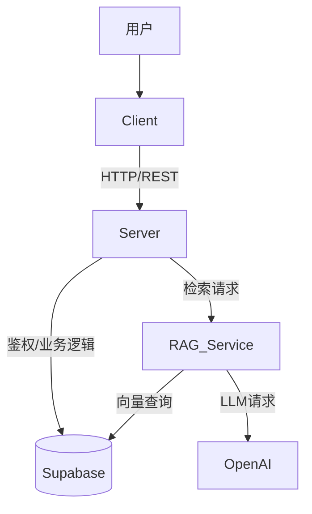

# DocuMind - 智能文档大脑

DocuMind 是一个全栈的 RAG (Retrieval-Augmented Generation) 应用程序，允许用户上传文档（如 PDF）并基于文档内容进行智能对话。项目采用现代化的技术栈，前后端分离架构，结合了高性能的向量检索服务。

## 🌟 项目亮点与技术难点

### 1. 🔐 **GitHub OAuth 第三方登录**
- **实现**: 集成了 GitHub OAuth 2.0 认证流程。
- **难点**: 处理 OAuth 回调、交换 Access Token、获取用户信息，并将其与本地 JWT 认证体系无缝融合，确保用户体验流畅且安全。

### 2. 📂 **大文件分片上传 (Large File Upload)**
- **实现**: 支持 GB 级别的大文件上传。
- **难点**: 
    - **分片策略**: 前端将大文件切分为 2MB 的小块并发上传，后端负责接收并按序合并。
    - **断点续传**: 利用文件 Hash 检测已上传的分片，网络中断后只需上传未完成的部分，极大地提升了上传的可靠性。

### 3. 🧵 **WebWorker 前端计算优化**
- **实现**: 在 WebWorker 中运行耗时的计算任务。
- **难点**: 
    - **主线程解耦**: 为了避免大文件计算 Hash 时阻塞 UI 渲染（导致页面卡顿），将计算密集型的 MD5 Hash 任务移至 WebWorker 后台线程运行。
    - **通信机制**: 设计了高效的主线程与 Worker 之间的消息通信机制，实时反馈计算进度。

### 4. 🎨 **动态主题配色切换**
- **实现**: 支持实时切换应用的主题色（Primary Color）和深色/浅色模式。
- **难点**: 
    - **性能优化**: 为了避免页面加载时的 "闪烁" (FOUC)，通过 `theme.js` 在 HTML 解析早期注入 CSS 变量，结合 `vite-plugin-pwa` 和内联脚本优化首屏渲染性能。
    - **全局一致性**: 使用 CSS Variables + Zustand 全局状态管理，确保所有组件和 Tailwind 类名能即时响应主题变化。

### 5. 🧠 **Python RAG 微服务解耦**
- **实现**: 将 RAG 核心逻辑（PDF 解析、Embedding 向量化、检索）剥离为独立的 Python FastAPI 服务。
- **难点**: 
    - **异构通信**: Node.js 后端与 Python 服务之间通过 HTTP 进行高效通信。
    - **性能瓶颈**: 解决了 Python 同步阻塞问题，移除了 `async` 关键字以利用线程池处理 CPU 密集型任务（如 PDF 解析），并优化了数据库的并发写入策略。

### 6. 🌊 **全链路流式输出 (Stream Output)**
- **实现**: 实现了类似 ChatGPT 的打字机效果。
- **难点**: 
    - **SSE (Server-Sent Events)**: 后端通过 SSE 协议实时推送 LLM 生成的 Token。
    - **前端解析**: 前端自定义 Hook 处理流式数据，实时拼接并渲染 Markdown，同时处理 RAG 检索到的“参考来源”数据，做到了数据与 UI 的平滑更新。

## 🏗️ 系统架构

项目包含三个主要服务：

1.  **Client (`/client`)**: 用户界面，负责聊天交互、文件上传和渲染 Markdown。
2.  **Server (`/server`)**: 业务网关，处理鉴权、文件存储、聊天历史记录，并转发 RAG 请求。
3.  **RAG Service (`/rag-service`)**: 核心 AI 服务，负责文档嵌入 (Embedding) 和向量检索 (Retrieval)。



## 🛠️ 技术栈

### 前端 (Client)
- **框架**: React 19, Vite 6
- **语言**: TypeScript
- **状态管理**: Zustand
- **UI 组件**: Radix UI, Lucide React
- **样式**: TailwindCSS v4
- **Markdown**: react-markdown, react-syntax-highlighter
- **HTTP**: Axios

### 后端 (Server)
- **运行环境**: Node.js
- **框架**: Express v5
- **数据库**: Supabase (PostgreSQL)
- **ORM/Query**: Supabase JS Client
- **认证**: JWT (JSON Web Tokens)
- **文件处理**: Multer

### AI 服务 (RAG Service)
- **语言**: Python 3.10+
- **框架**: FastAPI
- **AI/LLM**: OpenAI API
- **向量库**: Supabase (pgvector)

## 🚀 快速开始

### 1. 环境准备
确保你的本地环境已安装：
- Node.js (v18+)
- Python (v3.10+)
- PostgreSQL (或直接使用 Supabase 账号)

### 2. 数据库设置 (Supabase)
1.  创建一个 Supabase 项目。
2.  在 SQL 编辑器中启用 `vector` 扩展：
    ```sql
    create extension if not exists vector;
    ```
3.  运行项目中的迁移脚本（如有），确保创建了 `documents`, `messages`, `users` 等表，以及向量索引。
    *   参考 `server/migrations/optimize_indexes.sql` 进行索引优化。

### 3. 后端服务 (Server)
```bash
cd server
npm install

# 配置环境变量
# 复制 .env.example (如果存在) 或新建 .env 文件
# 填写: PORT=3000, SUPABASE_URL, SUPABASE_KEY, JWT_SECRET, OPENAI_API_KEY
```
启动服务：
```bash
npm run dev
```

### 4. RAG 服务 (Python)
```bash
cd rag-service

# 创建并激活虚拟环境
python -m venv .venv
# Windows:
..\.venv\Scripts\Activate.ps1
# Linux/Mac:
source .venv/bin/activate

# 安装依赖
pip install -r requirements.txt

# 配置环境变量 (.env)
# 填写: PORT=8000, OPENAI_API_KEY, SUPABASE_URL, SUPABASE_KEY
```
启动服务：
```bash
python main.py
```

### 5. 前端项目 (Client)
```bash
cd client
npm install

# 配置环境变量 (.env)
# 填写: VITE_API_URL=http://localhost:3000
```
启动开发服务器：
```bash
npm run dev
```

## 📝 环境变量说明

建议在各目录下创建 `.env` 文件：

**Server (`server/.env`)**
```env
PORT=3000
SUPABASE_URL=your_supabase_url
SUPABASE_KEY=your_supabase_anon_key
SERVICE_ROLE_KEY=your_service_role_key
JWT_SECRET=your_jwt_secret
OPENAI_API_KEY=sk-...
```

**RAG Service (`rag-service/.env`)**
```env
PORT=8000
OPENAI_API_KEY=sk-...
SUPABASE_URL=your_supabase_url
SUPABASE_KEY=your_supabase_key
```

**Client (`client/.env`)**
```env
VITE_API_URL=http://localhost:3000/api
```

## 📂 目录结构

```
chatLLM/
├── client/          # React 前端应用
├── server/          # Node.js 后端应用
├── rag-service/     # Python RAG 微服务
└── README.md        # 项目文档
```

## 🤝 贡献指南

1. Fork 本仓库
2. 创建特性分支 (`git checkout -b feature/AmazingFeature`)
3. 提交更改 (`git commit -m 'Add some AmazingFeature'`)
4. 推送到分支 (`git push origin feature/AmazingFeature`)
5. 提交 Pull Request

## 📄 许可证

[MIT](LICENSE)
