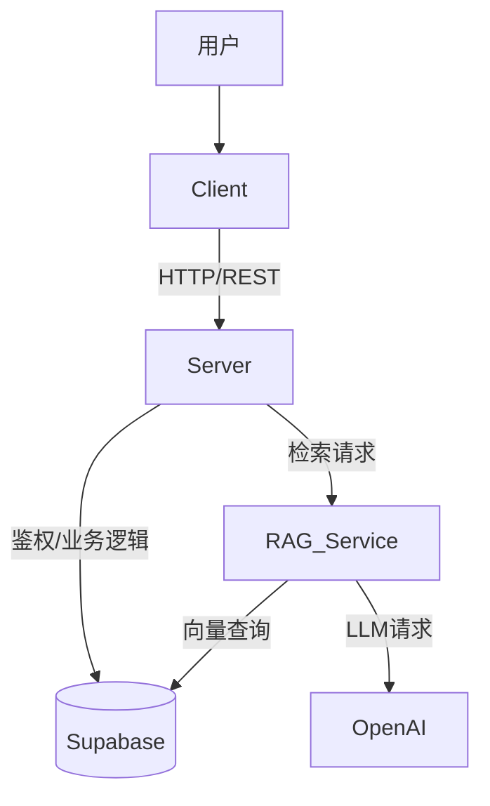

# ChatLLM - 智能文档问答系统

ChatLLM 是一个全栈的 RAG (Retrieval-Augmented Generation) 应用程序，允许用户上传文档（如 PDF）并基于文档内容进行智能对话。项目采用现代化的技术栈，前后端分离架构，结合了高性能的向量检索服务。

## 🌟 项目亮点

- **智能问答 (RAG)**: 基于 LangChain 和 OpenAI 实现的文档检索增强生成，支持精准的上下文问答。
- **文档处理**: 支持 PDF 文档上传、解析、分块及向量化存储。
- **流式响应**: 类似 ChatGPT 的打字机效果，实时流式输出 AI 回复。
- **现代化前端**: 基于 React 19 + Vite + TailwindCSS v4 构建，响应式设计，支持 PWA。
- **高性能后端**: Node.js (Express) 处理业务逻辑，Python (FastAPI) 处理 AI/RAG 核心任务。
- **向量数据库**: 使用 Supabase (PostgreSQL + pgvector) 存储和检索高维向量数据。

## 🏗️ 系统架构

项目包含三个主要服务：

1.  **Client (`/client`)**: 用户界面，负责聊天交互、文件上传和渲染 Markdown。
2.  **Server (`/server`)**: 业务网关，处理鉴权、文件存储、聊天历史记录，并转发 RAG 请求。
3.  **RAG Service (`/rag-service`)**: 核心 AI 服务，负责文档嵌入 (Embedding) 和向量检索 (Retrieval)。



## 🛠️ 技术栈

### 前端 (Client)
- **框架**: React 19, Vite 6
- **语言**: TypeScript
- **状态管理**: Zustand
- **UI 组件**: Radix UI, Lucide React
- **样式**: TailwindCSS v4
- **Markdown**: react-markdown, react-syntax-highlighter
- **HTTP**: Axios

### 后端 (Server)
- **运行环境**: Node.js
- **框架**: Express v5
- **数据库**: Supabase (PostgreSQL)
- **ORM/Query**: Supabase JS Client, Prisma (可选)
- **认证**: JWT (JSON Web Tokens)
- **文件处理**: Multer, pdf-parse

### AI 服务 (RAG Service)
- **语言**: Python 3.10+
- **框架**: FastAPI
- **AI/LLM**: LangChain, OpenAI API
- **向量库**: Supabase (pgvector)

## 🚀 快速开始

### 1. 环境准备
确保你的本地环境已安装：
- Node.js (v18+)
- Python (v3.10+)
- PostgreSQL (或直接使用 Supabase 账号)

### 2. 数据库设置 (Supabase)
1.  创建一个 Supabase 项目。
2.  在 SQL 编辑器中启用 `vector` 扩展：
    ```sql
    create extension if not exists vector;
    ```
3.  运行项目中的迁移脚本（如有），确保创建了 `documents`, `messages`, `users` 等表，以及向量索引。
    *   参考 `server/migrations/optimize_indexes.sql` 进行索引优化。

### 3. 后端服务 (Server)
```bash
cd server
npm install

# 配置环境变量
# 复制 .env.example (如果存在) 或新建 .env 文件
# 填写: PORT=3000, SUPABASE_URL, SUPABASE_KEY, JWT_SECRET, OPENAI_API_KEY
```
启动服务：
```bash
npm run dev
```

### 4. RAG 服务 (Python)
```bash
cd rag-service

# 创建并激活虚拟环境
python -m venv .venv
# Windows:
..\.venv\Scripts\Activate.ps1
# Linux/Mac:
source .venv/bin/activate

# 安装依赖
pip install -r requirements.txt

# 配置环境变量 (.env)
# 填写: PORT=8000, OPENAI_API_KEY, SUPABASE_URL, SUPABASE_KEY
```
启动服务：
```bash
python main.py
```

### 5. 前端项目 (Client)
```bash
cd client
npm install

# 配置环境变量 (.env)
# 填写: VITE_API_URL=http://localhost:3000
```
启动开发服务器：
```bash
npm run dev
```

## 📝 环境变量说明

建议在各目录下创建 `.env` 文件：

**Server (`server/.env`)**
```env
PORT=3000
SUPABASE_URL=your_supabase_url
SUPABASE_KEY=your_supabase_anon_key
SERVICE_ROLE_KEY=your_service_role_key
JWT_SECRET=your_jwt_secret
OPENAI_API_KEY=sk-...
```

**RAG Service (`rag-service/.env`)**
```env
PORT=8000
OPENAI_API_KEY=sk-...
SUPABASE_URL=your_supabase_url
SUPABASE_KEY=your_supabase_key
```

**Client (`client/.env`)**
```env
VITE_API_URL=http://localhost:3000/api
```

## 📂 目录结构

```
chatLLM/
├── client/          # React 前端应用
├── server/          # Node.js 后端应用
├── rag-service/     # Python RAG 微服务
└── README.md        # 项目文档
```

## 🤝 贡献指南

1. Fork 本仓库
2. 创建特性分支 (`git checkout -b feature/AmazingFeature`)
3. 提交更改 (`git commit -m 'Add some AmazingFeature'`)
4. 推送到分支 (`git push origin feature/AmazingFeature`)
5. 提交 Pull Request

## 📄 许可证

[MIT](LICENSE)
